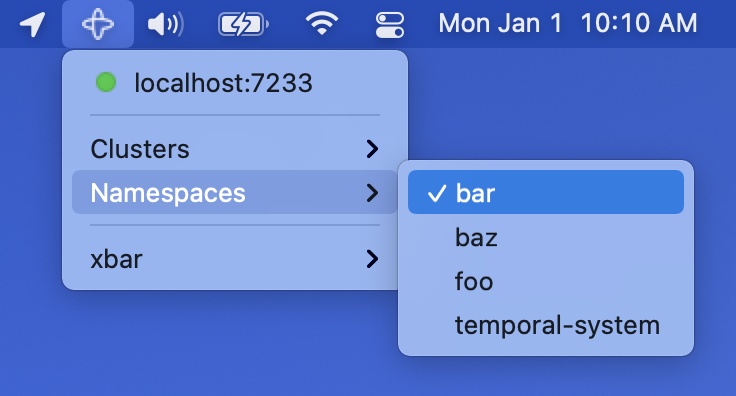

# Graphical User Interface

An [xbar](https://github.com/matryer/xbar) plugin is available which provides a graphical interface for visualizing and switching between Temporal contexts on macOS.



## Installation

> Note: This process may be streamlined by contributing the plugin to https://github.com/matryer/xbar-plugins in the future.

1. Install xbar: https://github.com/matryer/xbar#install
2. Copy `tctx.1m.sh` into your xbar plugins directory:
    ```bash
    cp ./internal/xbar/tctx.1m.sh $HOME/Library/Application\ Support/xbar/plugins/tctx.1m.sh
    ```
3. Reload xbar
